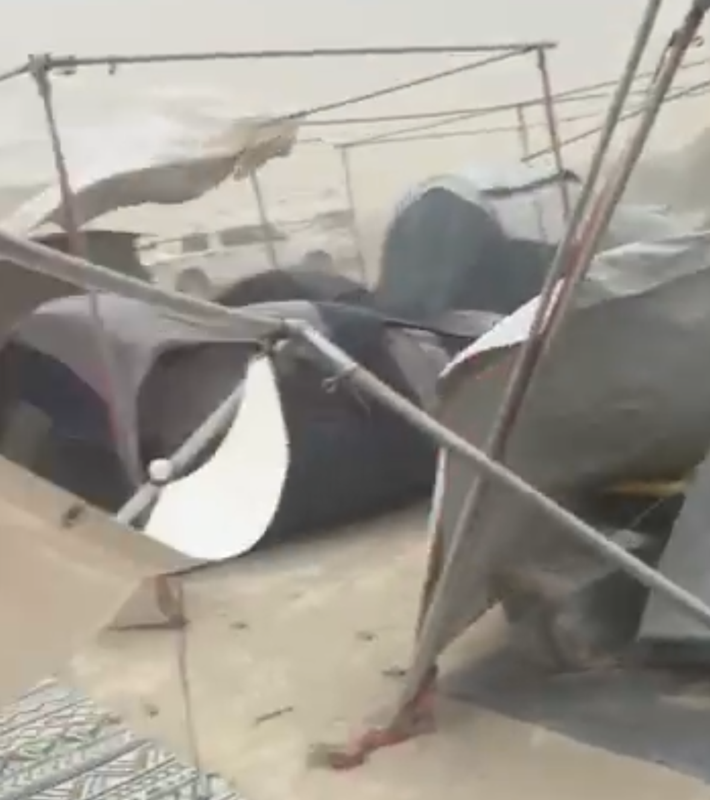

# EMT Shade Structure Builder



## Problem & Motivation

At Burning Man 2025, a huge storm caused many improperly built EMT (Electrical Metallic Tubing) shade structures to become airborne, damaging cars and posing serious safety risks to participants. These metal structures can be extremely dangerous when not constructed properly, especially in high wind conditions.

This project was born from that real-world incident to help people create proper visual instructions for building EMT shade structures (and other DIY projects) quickly and accurately. The goal is to prevent future accidents by ensuring structures are built correctly through clear, consistent visual guidance.

## Project Description

This is a React.js web application that leverages Google's Gemini AI to generate step-by-step visual instructions for DIY projects, with a focus on EMT shade structures for events like Burning Man.

The app works by:
1. Taking a text description of what you want to build
2. Using Gemini 2.5 Pro to break down the instructions into structured steps (JSON format)
3. Generating consistent-style images for each step using Gemini's visual model
4. Providing refinement options for both images and text instructions
5. Allowing users to publish and comment on the final instructions

## How to Launch

1. Clone the repository
2. Navigate to the client directory:
   ```bash
   cd client
   ```
3. Install dependencies:
   ```bash
   npm install
   ```
4. Start the development server:
   ```bash
   npm run dev
   ```

The app will be available at http://localhost:5173
